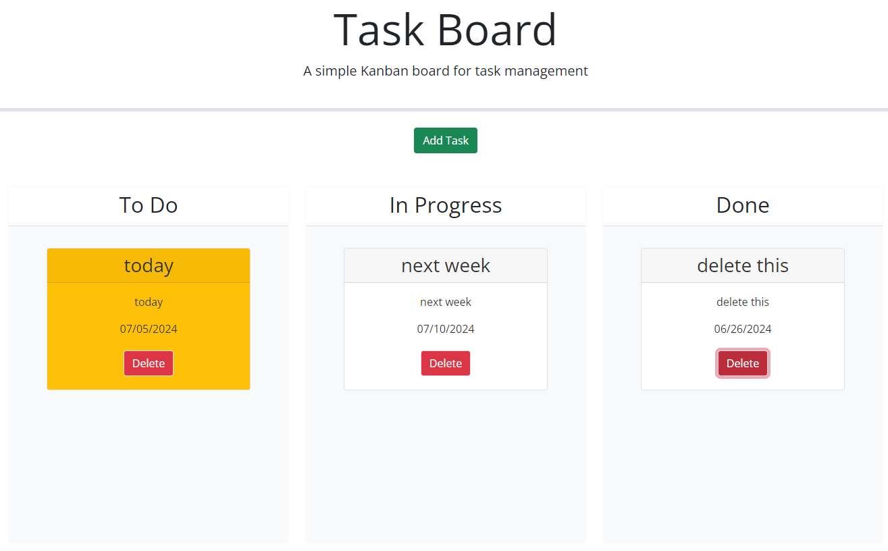
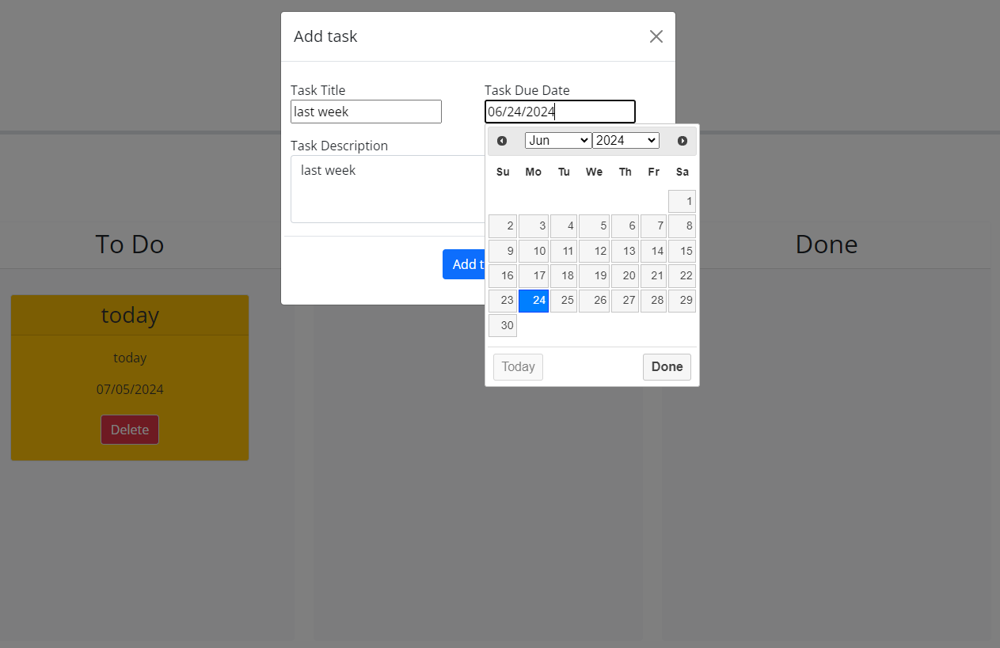
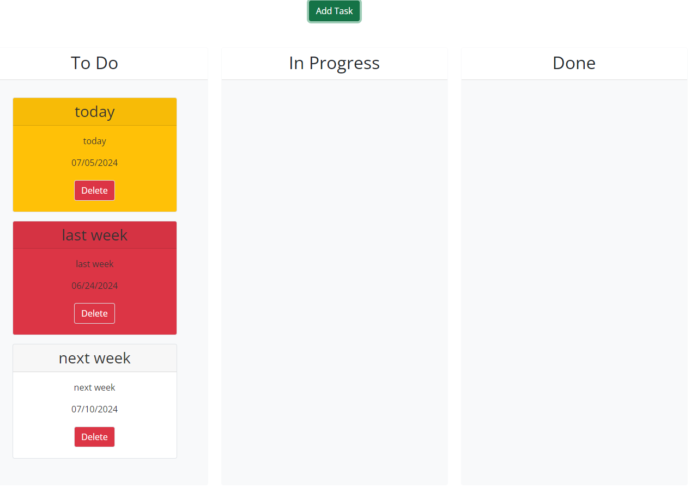
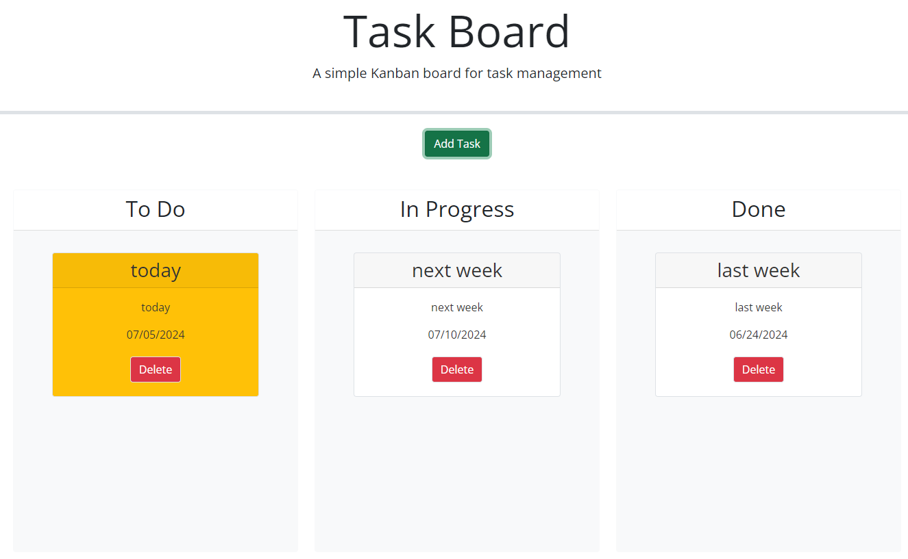

# task-board-by-3rd-apis
A very simple kanban that can add task and drag-n-drop task between swimlanes.  The tasks are stored in local storage.

## Project Title: 
Task Board

## Description:
The kanban task board consists of three swimlanes - to do, in progress and done.  The green "Add Task" button would trigger a modal pop up to take user's task information.  By default, task would start with the to do swimlane.  From there the user may drag-n-drop the task between the three swimlanes. The task has color theme that is determine by the swimlane at or the due date. If the task is in the done swimlane, the color theme would be white indicating no pressure. If the task is in to do or in progress, then the due date determines the color them.  Past due is red, on the current day is yellow and in the future is white.  The delete button deletes the task.  All changes are stored in localstorage.

## Usage:
open https://momokokong.github.io/task-board-by-3rd-apis/ directly from a browser.  Start with the green "Add Task" button and play with the task cards afterward.

## Screenshot:
Fronpage:  

Add a task:  

Task color themes:  

Task color themes by swimlane:  

## Contributing:
Let me know if there any tips to improve the page

## License: 
MIT 

## Contact:
[LinkedIn](https://www.linkedin.com/in/poshinhuang/)
